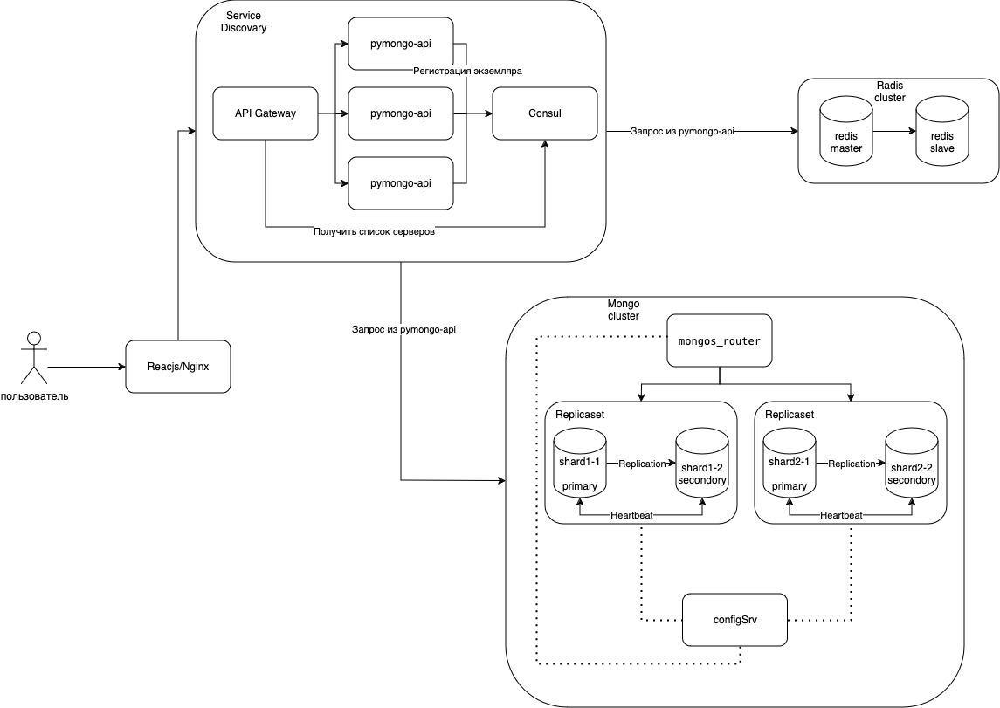
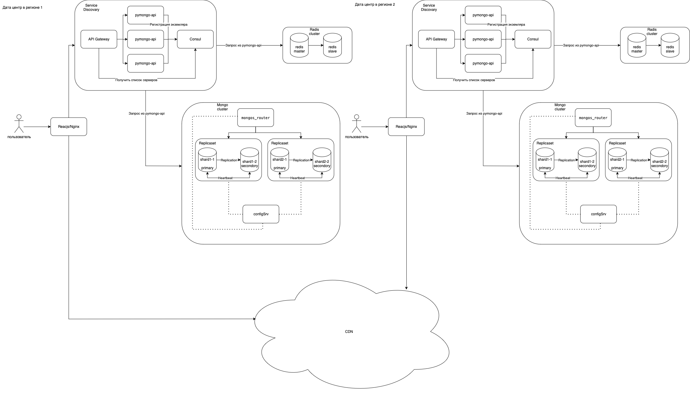

# pymongo-api

## Как запустить

Запускаем mongodb и приложение

```shell
docker compose up -d
```

Заполняем mongodb данными

```shell
./scripts/mongo-init.sh
```

## Как проверить

### Если вы запускаете проект на локальной машине

Откройте в браузере http://localhost:8080

### Если вы запускаете проект на предоставленной виртуальной машине

Узнать белый ip виртуальной машины

```shell
curl --silent http://ifconfig.me
```

Откройте в браузере http://<ip виртуальной машины>:8080

## Доступные эндпоинты

Список доступных эндпоинтов, swagger http://<ip виртуальной машины>:8080/docs

# Задание №1. Планирование

## Описание

>Вам предстоит реализовать шардирование, репликацию и кэширование. Чтобы это сделать, нужно распланировать изменения. 

>На основе шаблона вам нужно создать схему итогового решения. Рекомендуем работать над схемой в несколько этапов. Вот первые три шага:  
    1. Подготовьте первый вариант схемы. Изобразите, как вы будете использовать шардирование в MongoDB для повышения производительности. Двух шардов будет достаточно.  
    2. Подготовьте второй вариант схемы. Изобразите, как реализуете репликацию MongoDB для повышения отказоустойчивости. Чтобы это сделать, скопируйте первый вариант схемы и доработайте его таким образом, чтобы для каждого шарда была настроена репликация. Каждый шард должен иметь по три реплики.  
    3. Подготовьте третий вариант схемы. Изобразите, как реализуете кэширование для ещё большего повышения производительности. Чтобы это сделать, скопируйте второй вариант схемы и добавьте инстанс Redis для кэширования запросов приложения к MongoDB.  

## Решение 
Созданы схемы `drawio`, которые расположены следующем образом:  
```bash
├── mongo-sharding
│   └── stage1.drawio.png # Шардирование MongoDB
├── mongo-sharding-repl
│   └── stage2.drawio.png # Репликация MongoDB
├── sharding-repl-cache
│   └── stage3.drawio.png # Кеширование Redis
└── source.drawio.png # Исходная схема приложения

```

Публичные сcылки на схемы для задания:
- [stage1.drawio](https://drive.google.com/file/d/1uQVpIsvSohM8ESqAObCkIZZiVyrEo27O/view?usp=drive_link)
- [stage2.drawio](https://drive.google.com/file/d/1I6JZ4xDP0Go-VNDH7-e2_doq2XROwgKm/view?usp=sharing)
- [stage3.drawio](https://drive.google.com/file/d/1iNI2ah1KqZJZGMdFZRyW6E8_V07Bq8CX/view?usp=sharing)

# Задание 2. Шардирование
Описание и решение сделано в [./mongo-sharding](./mongo-sharding/README.md)  

# Задание 3. Репликация
Описание и решение сделано в [./mongo-sharding-repl](./mongo-sharding-repl/README.md)  

# Задание 4. Кэширование
Описание и решение сделано в [./sharding-repl-cache](./sharding-repl-cache/README.md)  

# Задание 5. Service Discovery и балансировка с API Gateway

## Описание 
>Составьте четвёртый вариант схемы. Изобразите, как вы реализуете горизонтальное масштабирование приложения. Для этого скопируйте третий вариант схемы и добавьте на него API Gateway для балансировки и Consul для Service Discovery.  

## Решение
Добавлена схема [stage4.drawio](https://drive.google.com/file/d/112c5kYuZGQ2xblnoA1lrZ8mn0rtQgfcv/view?usp=sharing) 

    

# Задание 6. CDN

## Описание
>Чтобы ускорить доставку статического контента пользователям в разных регионах, нужно использовать CDN.
Составьте пятый вариант схемы, на котором вы реализуете использование CDN. Для этого скопируйте прошлый вариант схемы и добавьте на него сервис CDN в нескольких регионах.


## Решение
Добавлена схема [stage5.drawio](https://drive.google.com/file/d/1hBiyE7G6swyaCDGzykZN8vRn9YUMlMNs/view?usp=sharing) 

