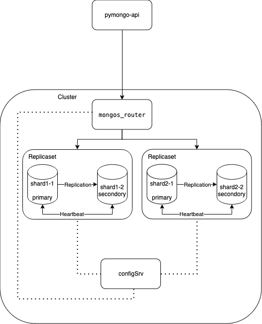

# Задание 3. Репликация

## Описание
>1. Скопируйте директорию с проектом mongo-sharding под новым именем mongo-sharding-repl.  
>2. В файле compose.yaml измените имя проекта на name: mongo-sharding-repl.  
>3. Модифицируйте compose.yaml таким образом, чтобы реализовать второй вариант схемы. За основу можете взять пример из урока про репликацию и кэширование.  
>4. В директории с проектом создайте файл README.md. Опишите там шаги, которые нужно выполнить, чтобы настроить репликацию для каждого шарда в MongoDB.  

## Решение

    

В `compose.yaml` добавлены компоненты `shard1_1`, `shard2_1` в соответствии со схемой.  
Скорректированы скрипты в `./scripts/mongo-init.sh`.  
Скорректированы `./api_app/app.py` и `./api_app/requirements.txt` для работы стенда, поскольку дефолтный стенд не заводился.

## Как запустить
```bash
# Запускаем стенд
docker compose up -d
# Проверяем, что стенд запустился
docker compose ps
# Выполняем инит скрипты для работы окружения
./scripts/mongo-init.sh
```

## Как проверить

Открыть в браузере http://localhost:8080

## Доступные эндпоинты

Список доступных эндпоинтов, swagger http://localhost:8080/docs