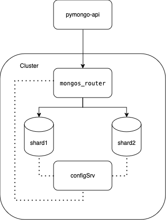

# Задание 2. Шардирование

## Описание
>1. Скопируйте исходную директорию с приложением и compose.yaml под новым именем mongo-sharding.
>2. В файле compose.yaml измените имя проекта на name: mongo-sharding.
>3. Модифицируйте compose.yaml таким образом, чтобы реализовать первый вариант схемы. За основу можете взять пример из урока про шардирование.
>4. В директории с проектом создайте файл README.md. Опишите там шаги для инициализации шардирования в MongoDB.

## Решение

    

В `compose.yaml` было добавлены  следующие компоненты `config_server`, `shard1`, `shard2`, `mongos_router`.  
В файл `./sctipts/mongo-init.sh` были добавлены команды для конфигурации и заполнения данными компонент.  
Скорректированы `./api_app/app.py` и `./api_app/requirements.txt` для работы стенда, поскольку дефолтный стенд не заводился.

## Как запустить

```bash
# Запускаем стенд
docker compose up -d
# Проверяем, что стенд запустился
docker compose ps
# Выполняем инит скрипты для работы окружения
./scripts/mongo-init.sh
```

## Как проверить

Открыть в браузере http://localhost:8080

## Доступные эндпоинты

Список доступных эндпоинтов, swagger http://localhost:8080/docs