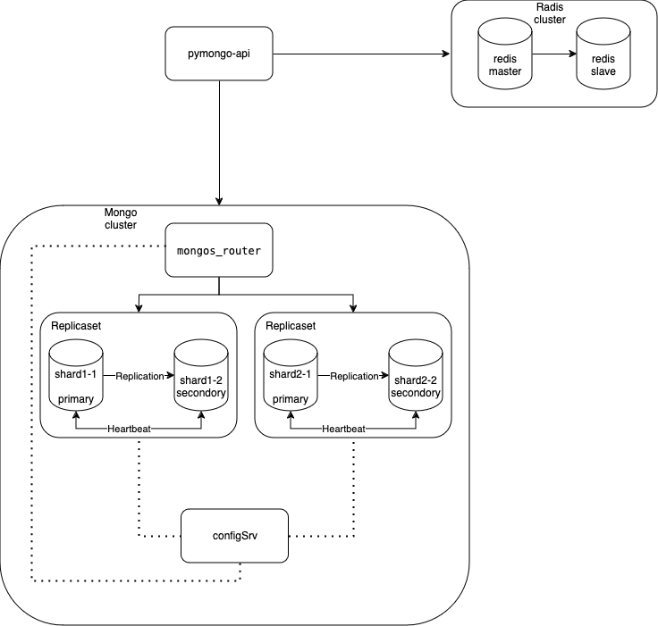

# Задание 4. Кэширование

## Описание
>1. Скопируйте директорию с проектом mongo-sharding-repl под новым именем sharding-repl-cache.  
>2. В файле compose.yaml измените имя проекта на name: sharding-repl-cache.  
>3. Модифицируйте compose.yaml таким образом, чтобы реализовать третий вариант схемы. В качестве ориентира можете использовать пример из урока про кэширование.  
>4. Чтобы включить кэширование в приложении, добавьте переменную окружения: `REDIS_URL: "redis://<redis-service-name>:6379"`.Вместо <redis-service-name> напишите имя сервиса redis.  
>5. В приложении кэширование доступно для эндпоинта `/<collection_name>/users`. Проверьте скорость выполнения повторных запросов — она должна увеличиться.

## Решение

    

В `compose.yaml` добавлены компоненты `redis_master`, `redis_slave` в соответствии со схемой.  
Скорректированы инит-скрипты в `./scripts/mongo-init.sh`.  
Скорректированы `./api_app/app.py` и `./api_app/requirements.txt` для работы стенда, поскольку дефолтный стенд не заводился.

К сожалению, python плохо знаю, чтобы поправить аппку для того, чтобы реализовать паттерн read replica для данного случая, поэтому в данном решении реплика присутствует номинально.

## Как запустить
```bash
# Запускаем стенд
docker compose up -d
# Проверяем, что стенд запустился
docker compose ps
# Выполняем инит скрипты для работы окружения
./scripts/mongo-init.sh
```

## Как проверить

Открыть в браузере http://localhost:8080

## Доступные эндпоинты

Список доступных эндпоинтов, swagger http://localhost:8080/docs